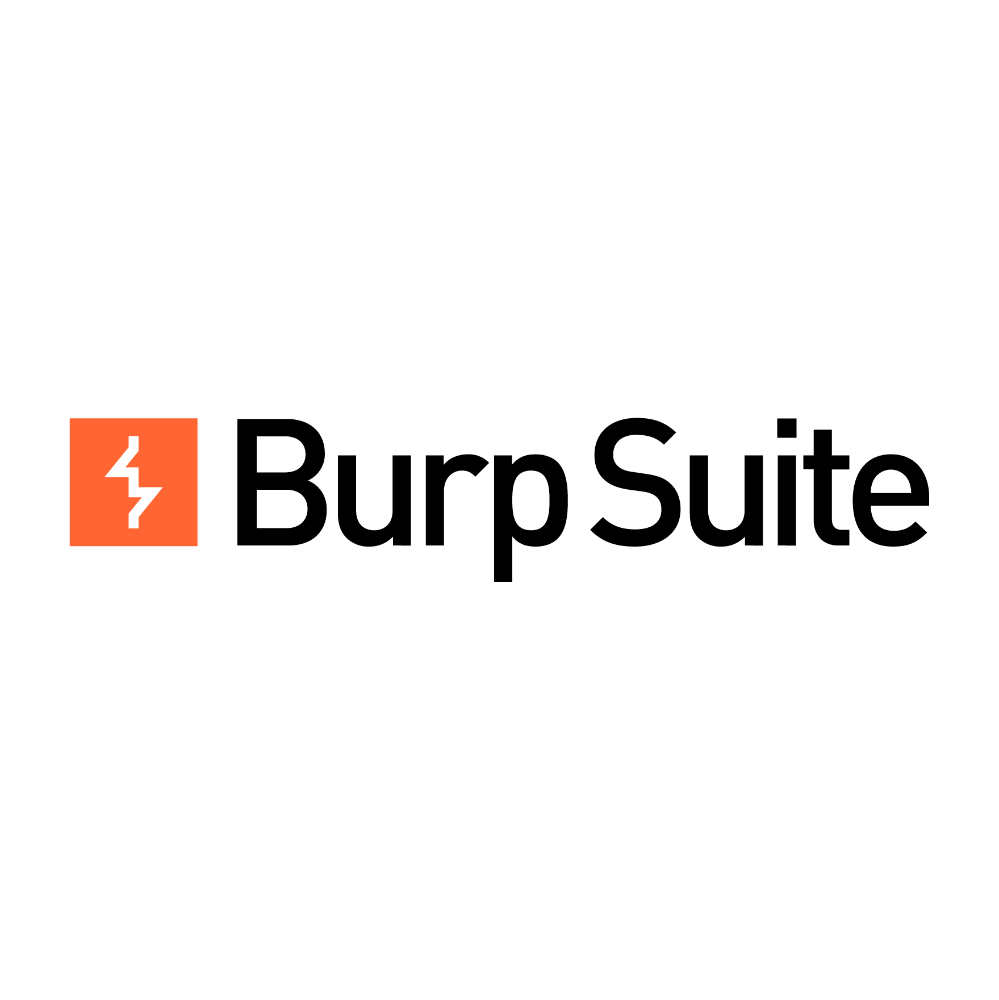

  

  

---
## Langages et Frameworks
| Langages | Frameworks |
| --- | --- |
|  Python |  NumPy |
|  R |  Pandas |
|  VBA |  Matplotlib |
|  Bash/Shell |  Scikit-learn |
|  PowerShell |  TensorFlow |
|  SQL |  PyTorch |

## Cybersecurity
| Scapy | Impacket | Cryptography | Volatility | Sqlmap | Nmap | Wireshark | Metasploit | Burp Suite |
|----------|----------|----------|----------|----------|----------|----------|----------|----------|
||||||  Nmap |  |  Metasploit |  |

## Data Manipulation and Environments
| Data Management Tools | Environments | Version Control / Testing | Data Tools |
| --- | --- | --- | --- |
|  Anaconda |  Docker |  Git |  Pycharm |
|  Jupyter |  Podman |   Pytest |  VsCode | |
|  MySQL |  VirtualBox |  Unittest |  GitHub Actions |
|  Postgres |  Kubernetes |  Postman |  Jenkins |
|  SQLite |  |  |  |

## Operating Systems
| Linux | Ubuntu | Kali | ParrotOS | Windows |
|----------|----------|----------|----------|----------|
|  |  |  |  |  |

---